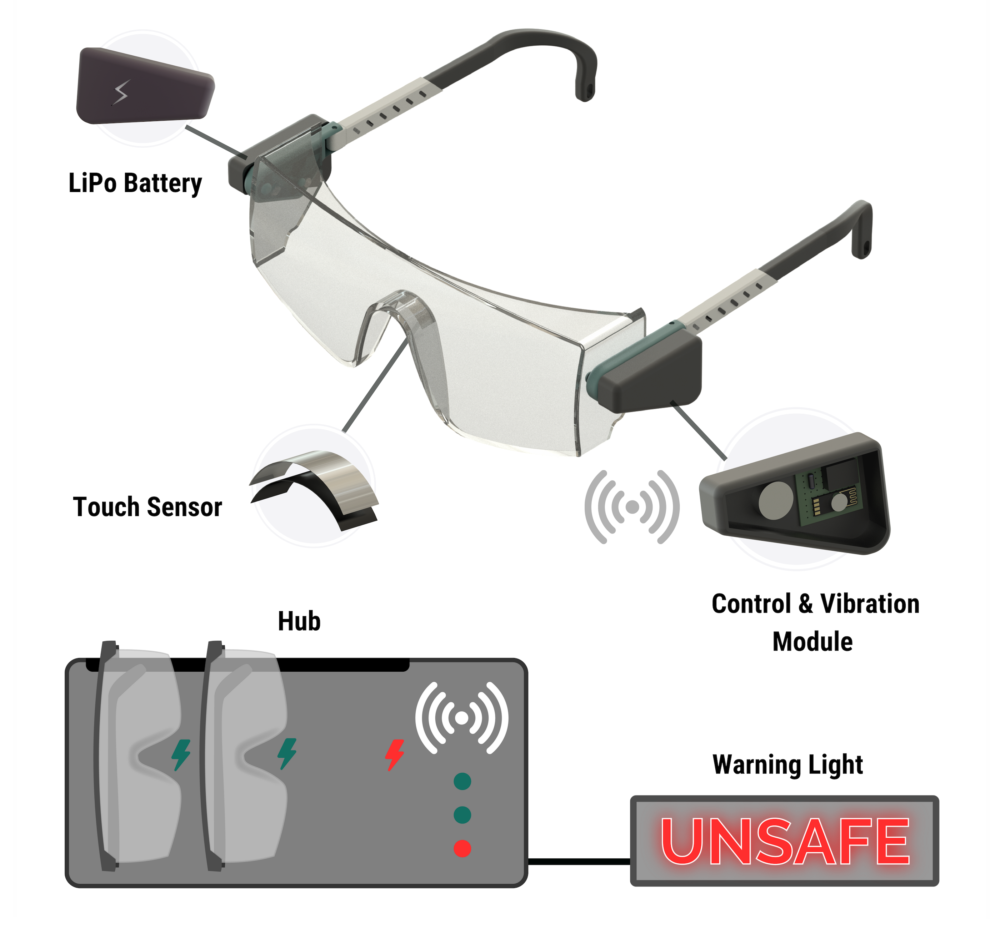

  

  <b> Gunvir Ranu | Katarina Chiam | Ken Shi | Spencer Ball </b>

eye**alert** is a safety glasses compliance & redundancy system that prompts users to put on their safety glasses when they forget to wear them. This system integrates regular safety glasses with 3 modules and a notification system the reminds users with visual and sensory cues. This significantly decreases the risk of danger caused by accidental carelessness in workspaces. Despite being originally designed for the Toronto Tool Library - Makerspace, it can be easily be used in a variety of locations.

  

